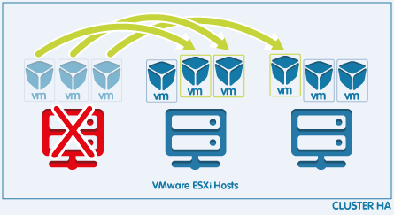
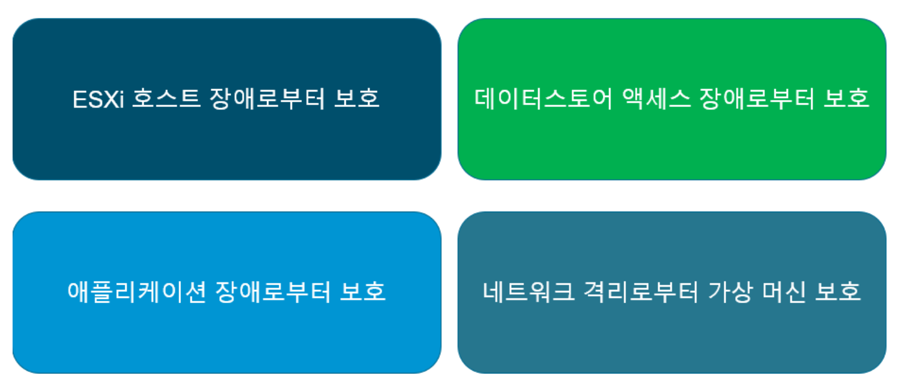

## 💡 vSphere란?
- **VMware**에서 제공하는 가상화 플랫폼으로, 주로 기업 환경에서 서버 가상화를 통해 효율적으로 자원을 관리하고, 클라우드 인프라를 구축하는데 사용된다. 즉, vSphere은 여러 대의 물리적인 서버를 가상화하여, 마치 하나의 거대한 컴퓨터처럼 사용할 수 있게 하는 기술이다.
- vSphere는 **ESXi 하이퍼바이저**와 **vCenter Server**라는 주요 구성 요소로 이루어져 있다. **ESXi**는 가상 머신을 실행하는 하이퍼바이저이며, **vCenter Server**는 여러 ESXi 호스트들과 가상 머신들을 중앙에서 관리하는 도구이다.
- 또한 **HA(고가용성), DRS(Distributed Resource Scheduler), vMotion, vSAN** 등의 고급 기능을 제공하여 IT 인프라의 안정성과 효율성을 크게 높일 수 있다.

## vSphere의 주요 구성 요소
### VMware ESXi
ESXi는 vSphere의 핵심 컴포넌트로, 물리적 서버에 설치되어 서버의 자원을 가상화한다. ESXi는 서버의 CPU, 메모리, 스토리지 등을 가상화하여 여러 개의 가상 머신을 실행할 수 있도록 한다.

### vCenter Server
여러 ESXi 호스트와 가상 머신을 중앙에서 관리하고 모니터링할 수 있는 관리 플랫폼이다. vCenter Server는 vSphere 환경에서의 고급 기능(RS, HA, vMotion 등)을 활성화하는 데 필수적인 역할을 한다.

### vSphere Client
vCenter Server에 접속하여 vSphere 환경을 관리할 수 있는 사용자 인터페이스이다. 사용자는 vSphere Client를 통해 가상 머신을 생성, 삭제, 수정할 수 있고, 자원 할당, 성능 모니터링, 백업 및 복구 작업도 수행할 수 있다.

## 💡 vSphere HA (High Availability)

HA는 서버나 가상 머신에 문제가 생겼을 때, 자동으로 가상 머신을 다른 호스트에서 재시작하여 서비스의 연속성을 보장한다.
vSphere HA는 VMware의 vSphere 플랫폼에서 제공하는 HA 기능이다. vSphere HA는 클러스터 내의 가상 머신이 실행되는 호스트(서버)에 문제가 발생했을 때, 자동으로 그 가상 머신을 다른 호스트에서 재시작하여 **서비스 중단을 최소화**한다.

## vSphere HA 주요 개념
### 클러스터
vSphere HA는 클러스터라는 개념을 중심으로 작동한다. 클러스터는 여러 대의 ESXi 호스트를 하나의 그룹으로 묶어서 관리하는 단위이다. 이 클러스터 내의 모든 호스트는 서로 협력하여 가상 머신을 운영하고, HA를 제공한다.

### 하트비트
HA는 하트비트라는 신호를 통해 호스트와 가상 머신의 상태를 지속적으로 모니터링한다. 각 호스트는 클러스터 내의 다른 호스트와 주기적으로 하트비트를 주고받아 '내가 살아있다'는 것을 알린다.
만약 어떤 호스트에서 하트비트 신호가 일정시간 동안 감지되지 않으면, HA는 그 호스트가 실패했다고 판단하고, 가상 머신을 다른 호스트에서 재시작한다.

### 마스터 호스트와 슬레이브 호스트
HA 클러스터 내에는 하나의 호스트가 **마스터 호스트**로 선택된다. 마스터 호스트는 클러스터를 관리하고, 각 호스트와 가상 머신의 상태를 모니터링하는 역할을 한다. 나머지 호스트들은 **슬레이브 호스트**로서 마스터 호스트의 명령을 따른다. 만약 마스터 호스트가 장애를 일으키면, 슬레이브 호스트들 중 하나가 새로운 마스터 호스트로 선택된다.

### 폴트 도메인
폴트 도메인은 장애 발생 가능성이 있는 특정 영역이나 그룹을 뜻한다. 예를 들어, 동일한 정원 공급 장치나 네트워크 스위치를 사용하는 호스트 그룹이 하나의 폴트 도메인이 될 수 있다. HA는 폴트 도메인을 고려하여 가상 머신을 안전하게 관리한다.

## vSphere HA의 작동

vSphere HA는 클러스터 내의 호스트와 가상 머신을 모니터링 하여, 다음 상황에서 자동으로 복구 작업을 수행한다.

### 호스트 장애 (Host Failure)
만약 클러스터 내의 한 호스트가 다운되거나 네트워크 연결이 끊어지면, HA는 그 호스트에서 실행 중이던 가상 머신을 다른 호스트에서 재시작한다.
이 과정에서 HA는 가상 머신의 최신 상태를 복구하기 위해 데이터스토어에 저장된 가상 머신의 이미지와 스냅샷을 사용한다.

### 가상 머신 장애 (VM Failure)
HA는 가상 머신 자체의 상태도 모니터링한다. 만약 가상 머신이 비정상적으로 종료되거나 작동하지 않는 경우, HA는 가상 머신을 동일한 호스트에서 재시작 하거나, 필요시 다른 호스트에서 재시작한다.

### 애플리케이션 모니터링
vSphere HA는 가상 머신 내부의 애플리케이션 상태도 모니터링할 수 있다. 애플리케이션이 응답하지 않으면, HA가 가상 머신을 재싲가하여 문제를 해결할 수 있다. VMware Tools와 연동하여 작동하는 기능이다.

## vSphere HA와 최적화

### 성능 최적화를 위한 고려사항
성능을 최적화하는 것은 아주 중요하다. 성능 최적화를 위해 고려해야 할 것은 다음과 같다.
1. 적절한 리소스 할당: 가상 머신이 적절한 CPU, 메모리 등을 충분히 받을 수 있게 설정해야 한다. 리소스를 너무 많이 주거나 너무 적게 주면 성능이 떨어질 수 있다.
2. 네트워크 최적화: 가상 머신이 서로 데이터를 빠르고 안정적으로 주고받을 수 있도록 네트워크 환경을 잘 구성해야 한다. 네트워크가 느리면 가상 머신의 성능도 느려질 수 있다.
3. 디스크 성능 관리: 가상 머신이 데이터를 저장하고 불러오는 속도가 중요하다. 디스크의 성능을 최적화하기 위해 SSD와 같은 빠른 저장 장치를 사용하는 것이 좋다.
4. HA 클러스터 크기 조정: 클러스터에 포함된 호스트의 수와 가상 머신의 수가 적절한지 확인해야 한다. 너무 많은 가상 머신을 한 클러스터에 몰아넣으면 성능이 떨어질 수 있다.

### 비용 최적화를 위한 고려사항
비용을 최적화하면서 고가용성을 유지하는 것은 아주 중요하다. 비용을 절감하기 위해 고려해야 할 것은 다음과 같다.
1. 자원 효율성 극대화: 필요 이상으로 많은 서버나 리소스를 사용하지 않도록 자원을 효율적으로 배치해야 한다. 가상 머신에 필요한 최소한의 리소스만 할당하는 것이 중요하다.
2. 중복 방지: 동일한 기능이나 역할을 하는 가상 머신이 중복되지 않도록 관리하고, 사용률이 낮은 가상 머신을 통합하여 자원 낭비를 줄일 수 있다.
3. 적절한 라이선스 관리: vSphere는 사용자가 사용하는 기능에 따라 라이선스 비용이 달라진다. 필요한 기능에 맞는 적절한 라이선스를 선택해서 비용을 절감할 수 있다.
4. 자동화 도구 활용: 자동화 스크립트를 사용하여 가상 머신의 백업, 복구, 리소스 최적화 작업을 자동화하면 인건비나 운영 비용을 줄일 수 있다.